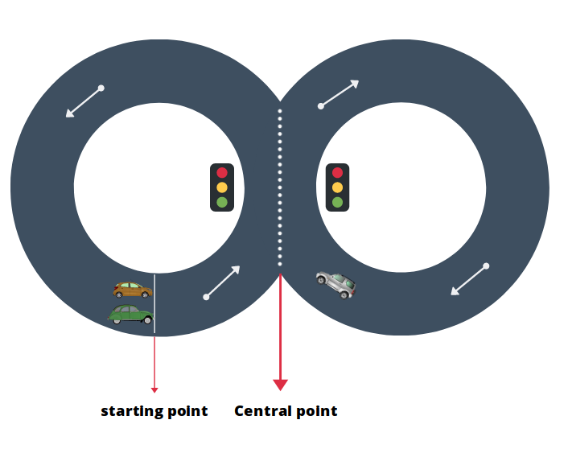
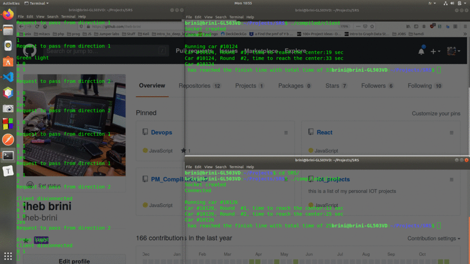

# SRS
In the project I created a car simulation demo using the concepts of multithreading and sockets in C.
For that a client (car) tries to connect to the server and once the connection is established, it starts moving on the racing track and  stops upon reaching the finish line.
The track has a loop shape form (as shown in the description down bellow) and contains 2 separate traffic lights with opposing states each can control access in both separate directions.
Keywords : 
- C programming language
- Multithreading 
- Socket programming 

  

# How to run ?

- Clone the repo
- `cd` into the `compiled` directory 
- Run the server `./server`
- Run a client instance `./client`

*Please note that you may need the OS execution permission you added by running `chmod +x server client`* 

# Quick Demo  

  

